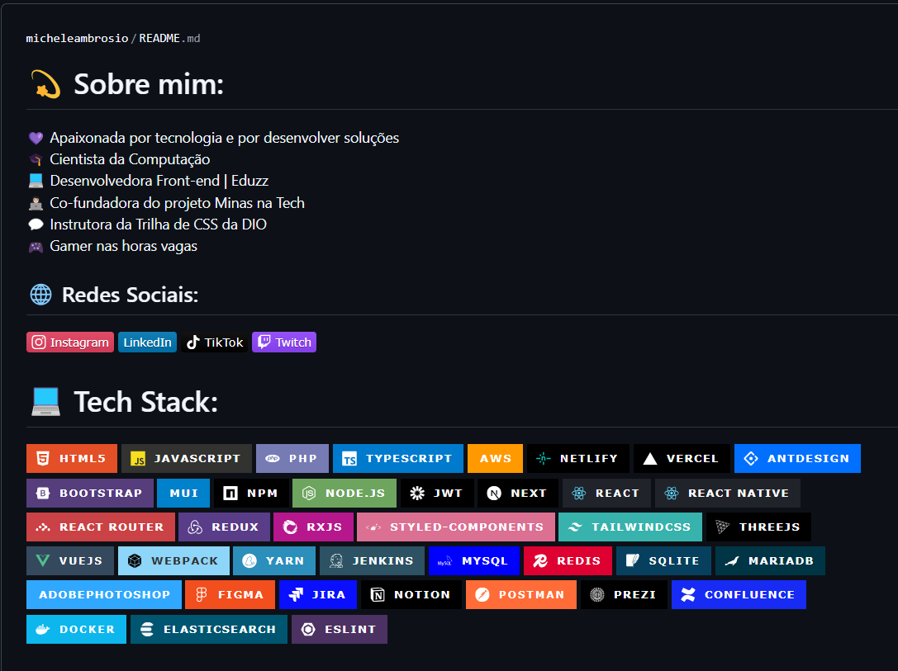

<h1>CSS - DIO</h1>

Professor Orientador: Michele Ambrosio.
=======

| Perfil GIT/GitHobby | Dados Profissionais. |
|---------------------------------------------|----------------------------------------| 
| |  |

## CERTIFICADO DE CONCLUSÃO DO CURSO...

# CSS_DIO
# CSS_DIO
